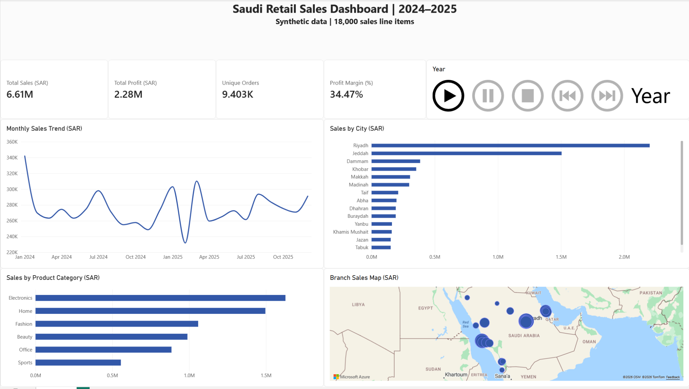

# Saudi Retail Sales Dashboard | 2024–2025

A Power BI portfolio project exploring **synthetic Saudi retail transactions** across 15 cities and 20 branches. I prepared the data in Excel, exported a CSV file, modeled it in Power BI, and built an interactive sales overview.

> **Data note:** All transactions are synthetic practice data. The figures do not represent a real company or actual Saudi retail performance.



The image shows the report at a single point in time. Open the PBIX in Power BI Desktop to use the interactive visuals and year animation.

## Dashboard

- KPI cards: total sales, profit, unique orders, and profit margin
- Monthly sales trend and breakdowns by city and product category
- Branch map and a year selector that automatically cycles between 2024 and 2025 during a presentation

| Metric | Value |
| --- | ---: |
| Sales line items | 18,000 |
| Unique orders | 9,403 |
| Sales | SAR 6,611,352.93 |
| Profit | SAR 2,279,244.17 |
| Profit margin | 34.47% |

These totals cover both years in the supplied CSV. Selecting a year changes the dashboard totals.

## Files

| File | Purpose |
| --- | --- |
| `Saudi_Retail_Dashboard.pbix` | Interactive Power BI Desktop report |
| `Saudi_Retail_Raw_Practice.xlsx` | Excel practice workbook |
| `Saudi_Retail_Raw_Practice.csv` | CSV exported from Excel and used for the Power BI workflow |

## Open the report

1. Download `Saudi_Retail_Dashboard.pbix` and open it in Power BI Desktop.
2. If you need to refresh the data, set the CSV source path to your local copy of `Saudi_Retail_Raw_Practice.csv` in **Transform data → Data source settings**.
3. On the **Sales Overview** page, use the year control. Its animation can cycle through years automatically when started.

The PBIX contains a custom **Play Axis (Dynamic Slicer)** visual. Power BI Desktop may ask you to enable or update that visual depending on your installation.

## Data preparation and measures

The source has one row per sales line item. I checked dates, numbers, and blank values in Excel, exported the dataset as CSV, and removed three empty trailing columns in Power Query. The report uses `DISTINCTCOUNT(order_id)` for unique orders and calculates profit margin as total profit divided by total revenue:

```DAX
Profit Margin % = DIVIDE(SUM(RetailSales[profit_sar]), SUM(RetailSales[revenue_sar]))
```

## Tools

Microsoft Excel · Power Query · Power BI Desktop · DAX
